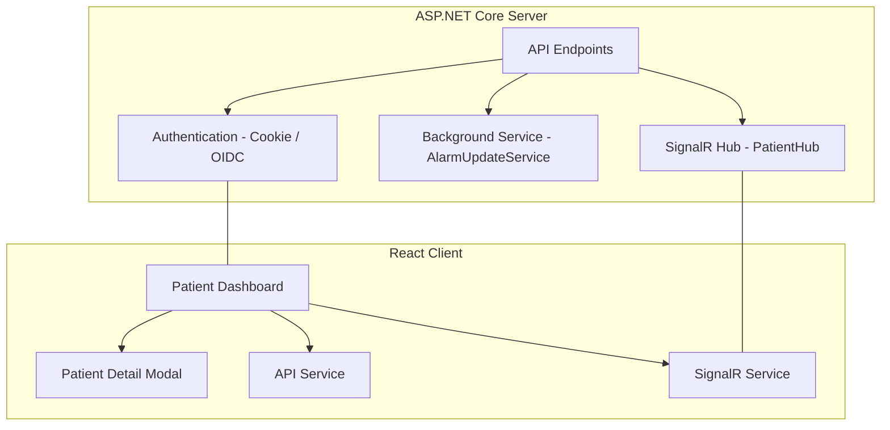
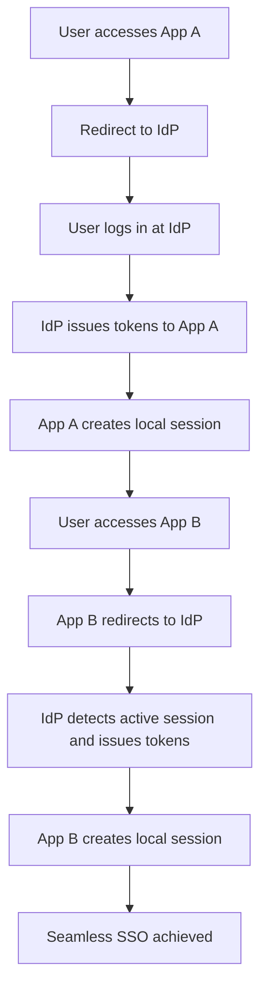

# PatientSync

**PatientSync** is a small healthcare app developed as part of a software engineering job screening exercise. It combines an ASP.NET Core backend (.NET 8, C#) with a dynamic React front-end (TypeScript, Vite) to manage patient data. Key features include real-time data synchronization via SignalR, user authentication with cookie-based auth (with potential extension to Single Sign-On using OpenID Connect), and a background service that simulates real-time alarm updates.

---

## Table of Contents

- [Features](#features)
- [Technology Stack](#technology-stack)
- [Prerequisites](#prerequisites)
- [Installation and Setup](#installation-and-setup)
  - [Backend (ASP.NET Core)](#backend-aspnet-core)
  - [Frontend (React with TypeScript)](#frontend-react-with-typescript)
- [Usage](#usage)
- [Real-Time Data Synchronization](#real-time-data-synchronization)
- [Additional Questions](#additional-questions)
  - [Multi-Tab Synchronization (Problem 1)](#multi-tab-synchronization-problem-1)
  - [Single Sign-On Across Multiple Applications (Problem 2)](#single-sign-on-across-multiple-applications-problem-2)
- [Architecture](#architecture)
- [Future Tasks and Considerations](#future-tasks-and-considerations)

---

## Features

- **User Authentication:**  
  - Cookie-based authentication using ASP.NET Core.
  - Designed to extend to Single Sign-On (SSO) via OAuth 2.0/OpenID Connect.
- **Patient Dashboard:**  
  - Displays patient data in a grid with filtering and sorting.
  - Shows key details: Family Name, Given Name, Sex, formatted Birth Date, parameter count, and an alarm indicator.
- **Patient Detail Dialog:**  
  - A modal dialog that presents detailed patient information and a complete list of parameters.
- **Real-Time Updates:**  
  - SignalR integration auto-refreshes the dashboard and synchronizes UI actions across multiple browser tabs.
- **In-Memory Data Storage:**  
  - Implements a repository pattern with full CRUD operations for Users, Patients, and Parameters.
- **Background Processing:**  
  - A background service updates patient parameter alarms every 10 seconds.

---

## Technology Stack

- **Backend:** ASP.NET Core (.NET 8), C#
- **Frontend:** React with TypeScript, Vite
- **Real-Time Communication:** SignalR
- **Authentication:** Cookie Authentication (extendable to OpenID Connect-based SSO)
- **Testing:** xUnit (server-side); Vitest/Jest (client-side)
- **Logging:** Serilog
- **Version Control:** Git, GitHub

---

## Prerequisites

- [.NET 8 SDK](https://dotnet.microsoft.com/download)
- [Node.js and npm](https://nodejs.org/)
- [Git](https://git-scm.com/)

---

## Installation and Setup

### Backend (ASP.NET Core)

1. **Clone the Repository:**

   ```bash
   git clone https://github.com/Peace44/PatientSync.git
   ```

2. **Navigate to the Backend Project:**

   ```bash
   cd PatientSync/PatientSync.Server
   ```

3. **Restore Dependencies and Run:**

   ```bash
   dotnet restore
   dotnet run
   ```

   The server should be running at a URL such as `https://localhost:5001`.

### Frontend (React with TypeScript)

1. **Navigate to the Frontend Project:**

   ```bash
   cd PatientSync/patientsync.client
   ```

2. **Install Dependencies:**

   ```bash
   npm install
   ```

3. **Run the Development Server:**

   ```bash
   npm run dev
   ```

   The client will run via the Vite development server.

---

## Usage

- **User Authentication:**  
  Log in using the default credentials (e.g., Username: `admin`, Password: `password`).

- **Patient Dashboard:**  
  - View patient data in a grid that supports filtering and sorting.
  - Click on a patient row to open a modal dialog displaying detailed patient information and parameters.

- **Real-Time Updates:**  
  - The dashboard auto-refreshes via SignalR when the background service updates patient parameter alarms.
  - Multi-tab synchronization ensures consistent UI updates across all open tabs.

---

## Real-Time Data Synchronization

- **SignalR Hub:**  
  The backend exposes a SignalR hub (`PatientHub.cs`) at `/patientHub` to broadcast update events to all connected clients.

- **Background Service:**  
  The `AlarmUpdateService` periodically updates patient parameter alarms and sends a `ReceivePatientUpdate` event via SignalR.

- **Client Integration:**  
  The client-side SignalR service (`signalRService.ts`) subscribes to these events (as well as to the `"OpenPatientDetail"` event for multi-tab synchronization), triggering auto-refresh and UI updates on the dashboard.

---

## Additional Questions

### Multi-Tab Synchronization (Problem 1)

PatientSync ensures that data and UI state remain synchronized across multiple browser tabs using SignalR.

- **Server-Side Implementation:**
  - The SignalR hub (in `PatientHub.cs`) provides a method to broadcast UI actions:
    ```csharp
    public async Task SyncOpenPatientDetail(int patientId)
    {
        // Broadcast the "OpenPatientDetail" event to all connections for the current user.
        await Clients.User(Context.UserIdentifier).SendAsync("OpenPatientDetail", patientId);
    }
    ```
  - This method leverages `Context.UserIdentifier` to send the event to every connection (i.e., every open tab) associated with the same user.

- **Client-Side Handling:**
  - Each browser tab creates its own SignalR connection and registers an event handler for `"OpenPatientDetail"`:
    ```typescript
    connection.on("OpenPatientDetail", (patientId: number) => {
      console.log("Received request to open patient detail for patientId:", patientId);
      onOpenDetail(patientId);
    });
    ```
  - When one tab triggers the opening of a patient detail dialog, all connected tabs receive the event and update their UI accordingly.

- **Visual Representation:**

  ```mermaid
  graph TD
      A[Tab 1: User opens detail dialog] --> B[SignalR Hub receives event]
      B --> C[Hub broadcasts 'OpenPatientDetail' to all user connections]
      C --> D[Tab 1 updates UI]
      C --> E[Tab 2 updates UI]
      C --> F[Tab 3 updates UI]
  ```

### Single Sign-On Across Multiple Applications (Problem 2)

For seamless Single Sign-On (SSO) across different web applications, PatientSync is designed to integrate with a centralized Identity Provider (IdP) using OAuth 2.0/OpenID Connect.

- **Centralized Identity Provider (IdP):**
  - An IdP (such as IdentityServer, Auth0, Okta, or Azure AD) handles user authentication and issues tokens (ID and access tokens) upon successful login.

- **ASP.NET Core Integration:**
  - Each web application is configured as a relying party. For example, in the ASP.NET Core configuration:
    ```csharp
    builder.Services.AddAuthentication(options =>
    {
        options.DefaultScheme = CookieAuthenticationDefaults.AuthenticationScheme;
        options.DefaultChallengeScheme = OpenIdConnectDefaults.AuthenticationScheme;
    })
    .AddCookie(options => { options.Cookie.Name = "PatientSyncAuthCookie"; })
    .AddOpenIdConnect(options =>
    {
        options.Authority = "https://your-idp.com";
        options.ClientId = "your-client-id";
        options.ClientSecret = "your-client-secret";
        options.ResponseType = "code";
        options.SaveTokens = true;
        options.Scope.Add("openid");
        options.Scope.Add("profile");
    });
    ```
  - This configuration ensures that when a user logs in through the IdP in one application, the same authentication token is recognized by other applications.

- **User Experience Flow:**
  1. The user logs in via Application A, is redirected to the IdP, and receives tokens.
  2. Application A creates a local session using cookie authentication.
  3. When the user accesses Application B, it also redirects to the IdP.
  4. The IdP detects the active session and issues tokens immediately.
  5. Application B creates its own local session without prompting for credentials—achieving seamless SSO.

- **Visual Representation:**

  ```mermaid
  flowchart TD
      A[User accesses App A] --> B[Redirect to IdP]
      B --> C[User logs in at IdP]
      C --> D[IdP issues tokens to App A]
      D --> E[App A creates local session]
      E --> F[User accesses App B]
      F --> G[App B redirects to IdP]
      G --> H[IdP detects active session and issues tokens]
      H --> I[App B creates local session]
      I --> J[Seamless SSO achieved]
  ```

---

## Architecture

PatientSync is built on a modern, scalable architecture that decouples the backend services from the frontend UI while enabling real-time updates and robust authentication.

### High-Level Components

- **ASP.NET Core Server:**
  - **API Endpoints:**  
    Provide full CRUD operations for Users, Patients, and Parameters.
  - **SignalR Hub (`PatientHub.cs`):**  
    Enables real-time communication by broadcasting update events to all connected clients.
  - **Background Service (`AlarmUpdateService`):**  
    Periodically updates patient parameter alarms (every 10 seconds) and pushes notifications via SignalR.
  - **Authentication:**  
    Uses cookie-based authentication and is designed to integrate with a centralized IdP for SSO.

- **React Client:**
  - **Patient Dashboard:**  
    Displays a grid of patient data with filtering and sorting capabilities.
  - **Patient Detail Modal:**  
    A modal dialog that shows detailed patient information and a complete list of parameters.
  - **API Service:**  
    Manages HTTP requests to the backend.
  - **SignalR Service:**  
    Maintains a real-time connection to receive updates and synchronize UI actions (including multi-tab synchronization).

### Visual Architecture Diagram



### Authentication & SSO Flow Diagram



---

## Future Tasks and Considerations

- **Testing:**  
  - Implement comprehensive unit and integration tests for the backend (using xUnit) and the frontend (using Vitest or Jest).
  - Execute tests with:
    ```bash
    dotnet test
    ```
    ```bash
    npm run test
    ```

- **Deployment:**  
  - Publish the ASP.NET Core application for production:
    ```bash
    dotnet publish -c Release -o ./publish
    ```
  - Build the React client:
    ```bash
    npm run build
    ```
  - Configure production settings in `appsettings.Production.json` and set necessary environment variables.
  - Set up deployment pipelines for continuous integration/continuous deployment (CI/CD).

- **Enhanced Documentation:**  
  - Consider generating API documentation using Swagger and client documentation using TypeDoc.
  - Create and maintain architecture diagrams using tools like Mermaid, draw.io, or Lucidchart.

- **Security Enhancements:**  
  - Implement password hashing and secure storage for user credentials.
  - Extend authentication to support SSO using OAuth 2.0/OpenID Connect with a centralized Identity Provider.

- **Performance and Monitoring:**  
  - Optimize data retrieval and consider caching strategies.
  - Integrate monitoring and logging (e.g., via Serilog) to track performance and diagnose issues in production.
